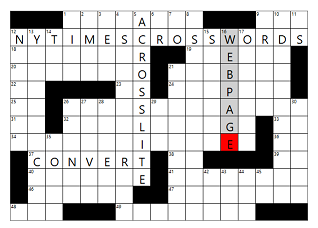

# NYT Crossword to Puz



A windows program to convert NY Times crosswords from the web to Across Lite compatible files.

To run this, first download and decompress the [release](https://github.com/Q726kbXuN/nytxw_puz/releases/latest/download/nytxw_puz.zip).  Then, run the executable, and answer the three questions:


```
 1) Chrome
 2) Chromium
 3) Firefox
 4) Microsoft Edge
 5) Opera
Please select a browser that's logged into NYTimes.com: 1
Enter the NY Times crossword URL: https://www.nytimes.com/crosswords/game/daily/1994/02/14
Enter the output filename: example.puz
Loading https://www.nytimes.com/crosswords/game/daily/1994/02/14...
Created example.puz
```

Note: Running this script requires you're logged into nytimes.com in your browser.

Alternatively, you can pass in the browser, URL, and filename from the command line.

To run the Python script directly, clone this repo, then setup the venv to download packages:
```
python -m venv .venv
.venv\Scripts\activate.bat
```

And install the packages:
```
python -m pip install -r requirements.txt
```

Then, to use:
```
nyt.py Chrome https://www.nytimes.com/crosswords/game/daily/2021/08/03 2021-08-03.puz
```

# Mini FAQ

* What? Why?

The New York Times announced that on August 10th, 2021, [they will no longer provide](https://www.nytimes.com/2021/08/02/crosswords/nyt-games-no-longer-available-on-across-lite-as-of-aug-9.html) Across Lite .puz files for download.  This tool was made in response to that decision, allowing users of that tool to continue to solve crossword puzzles in their favorite program.

* Why not just use the NY Times app?

For me personally, I want something that works completely offline, and doesn't require I stare at my phone even more.  I'm sure other people have other reasons, so I decided to put my little tool online for others to use.

* Help?  How do I run this?

Try following [these directions](howto.md).

* I downloaded this a while ago and it stopped working!

Please update to at least version 1.07.  There was a change with how the puzzles are published that broke older versions of this program.

* Anything else?

Feel free to contact me on [reddit](https://www.reddit.com/user/nobody514/).
