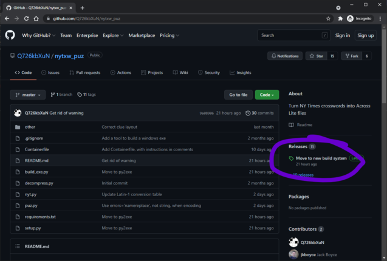
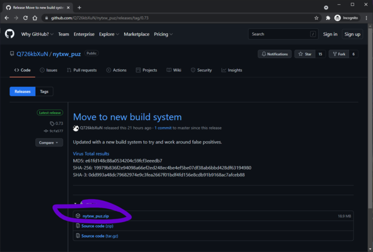
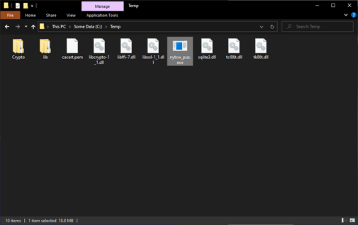
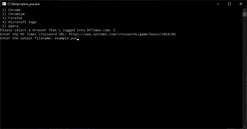
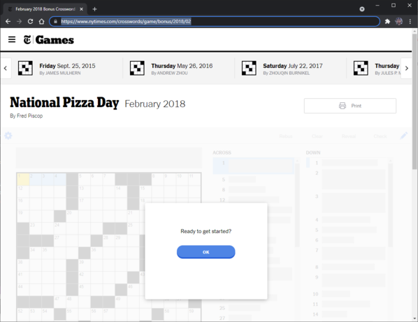
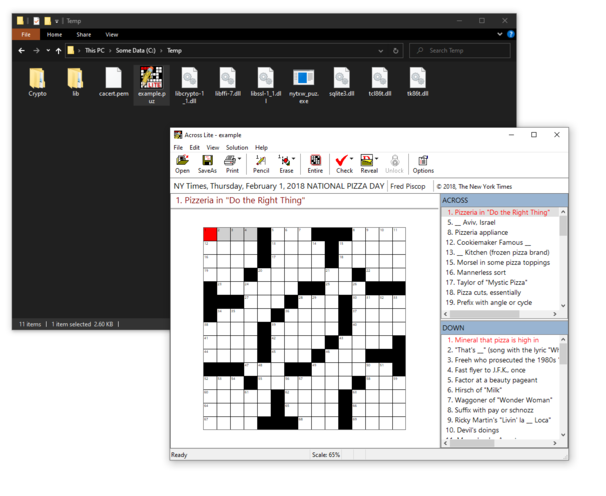

# How to install and use

First off, click on the releases link

Then click on the release zip file to download it.

If you open the zip file, you'll see it contains several files. You want to extract all of the files to a directory on your local computer.

Once done, double click on `nytxw_puz.exe`

That will open a console window asking three questions.  Pick the browser you're logged into NY Times with (I used Chrome here), and copy the URL from the puzzle you want to convert, by copy-n-pasting it from the website:

And type in the output filename.

Once it's done, the file will be created, and you can open it in your favorite application:

