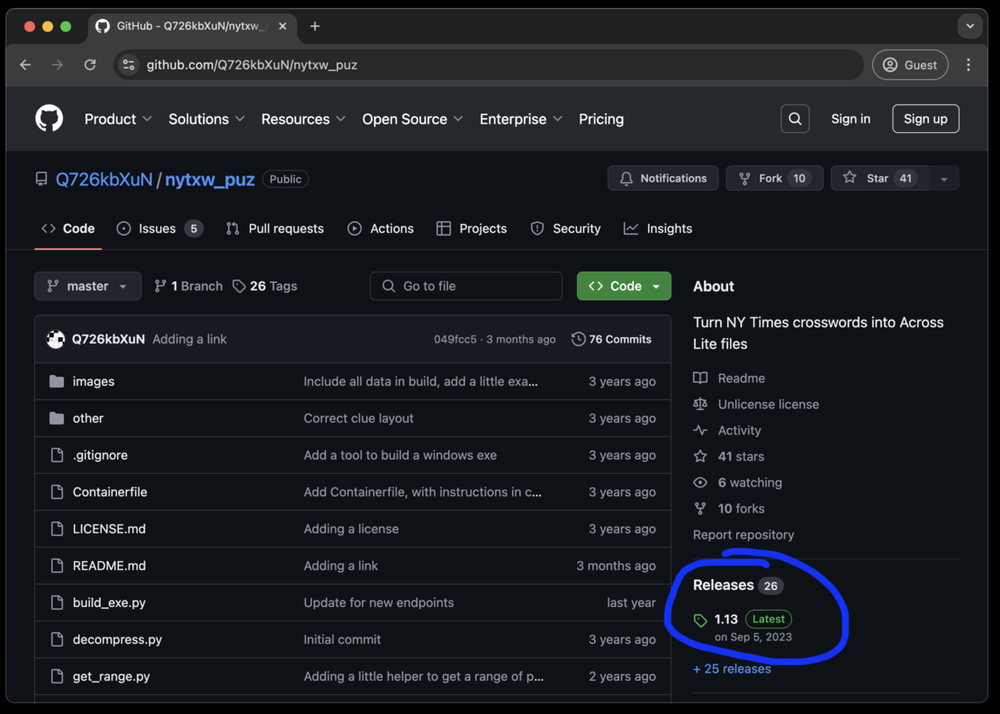
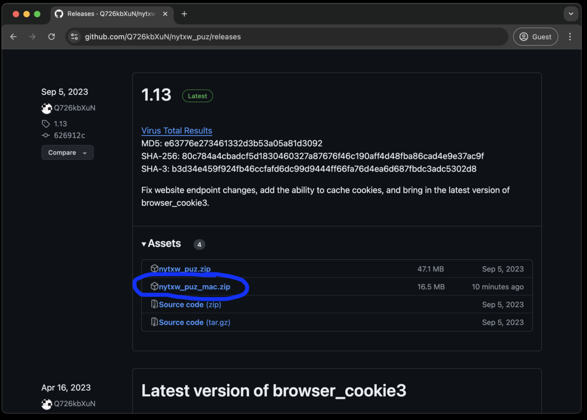
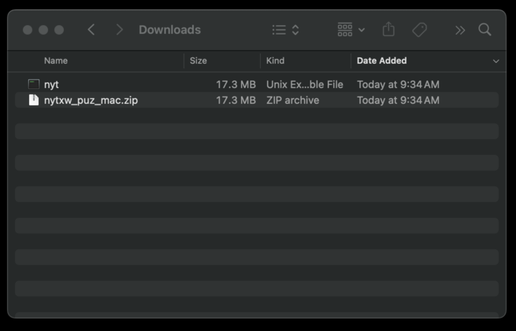
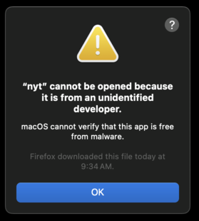
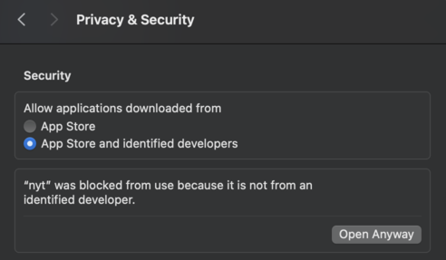
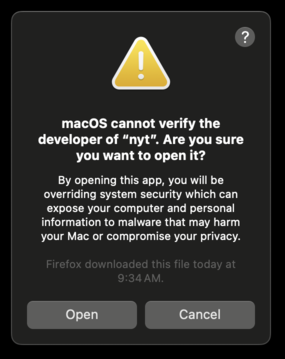
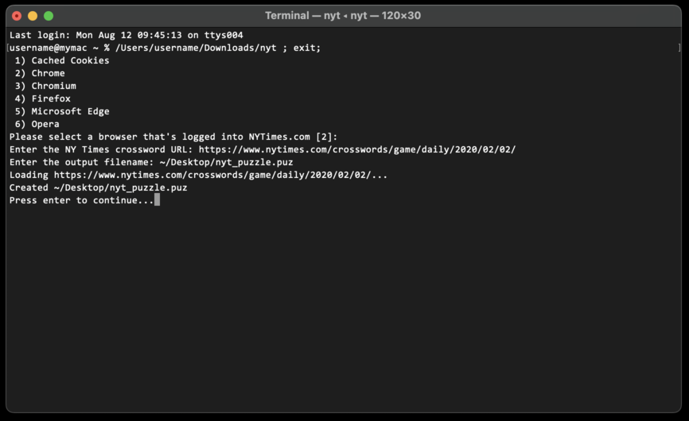

# How to install and use

First off, click on the releases link

Then click on the release zip file to download it.

If you open the zip file, Finder will extract the executable in it.  From there, click on the "nyt" executable:

Once you see this, open Security in the System Settings, and scroll down to the bottom:

And click "Open anyway" to allow NYT to open.

This will trigger a final confirmation that you want to open the executable.

Once open, it will display a terminal window:

This will ask a few questions, provide a browser that can be used to gather the NY Times cookies, a URL of a puzzle to download, and a destination to store the downloaded puzzle.  Once done, you can open the .puz file in a viewer, such as Across Lite:

